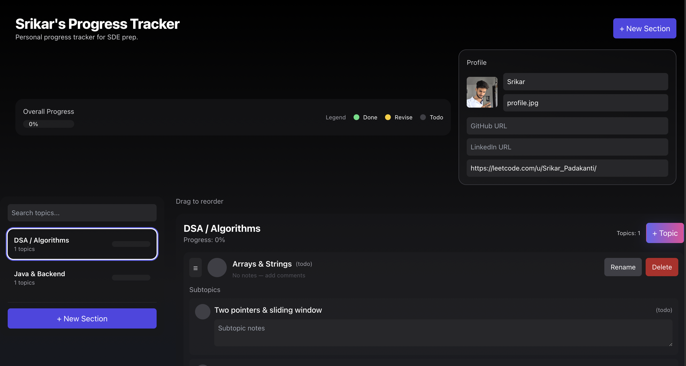
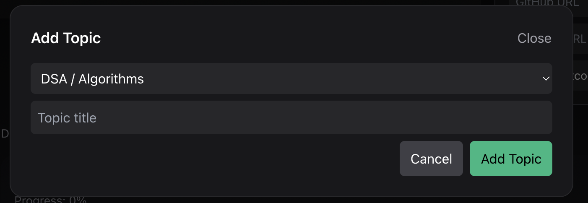
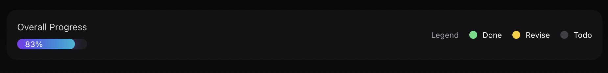

# Personal Progress Tracker | Preparation Dashboard

A **full-stack React application** to track your learning journey, topics, and subtopics for preparation. This interactive tracker helps you organize study sections, manage topics/subtopics, and visualize progress with a sleek UI.

---

## Features

- **Sections & Topics:** Create multiple sections (DSA, Java, System Design, etc.) and add topics/subtopics.
- **Progress Tracking:** Visual progress bars for sections and overall completion.
- **Drag & Drop:** Reorder topics within a section using drag-and-drop.
- **Status Management:** Cycle through statuses: `To-do`, `Done`, `Revise`.
- **Notes & Links:** Add notes, references, or commands to each topic/subtopic.
- **Profile Management:** Customize your profile with name, picture, and links (GitHub, LinkedIn, LeetCode).
- **Persistence:** Data is stored in `localStorage` — your progress stays across sessions.
- **Responsive Design:** Mobile-first and looks clean on all screen sizes.

---

## Demo

Check it live on GitHub Pages:  
[Personal Progress Tracker](https://srikarpadakanti.github.io/Personal-progress-tracker/)

---

## Screenshots







---

## Tech Stack

- **Frontend:** React 19, TailwindCSS 3, @hello-pangea/dnd (drag & drop)
- **Persistence:** LocalStorage
- **Build Tool:** Vite
- **Deployment:** GitHub Pages

---

## Installation & Running Locally

```bash
# Clone the repository
git clone https://github.com/srikarpadakanti/Personal-progress-tracker.git
cd Personal-progress-tracker

# Install dependencies
npm install

# Start development server
npm run dev
```
